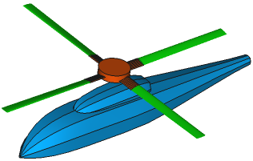
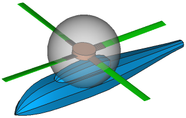
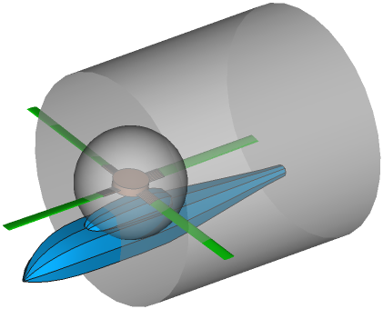
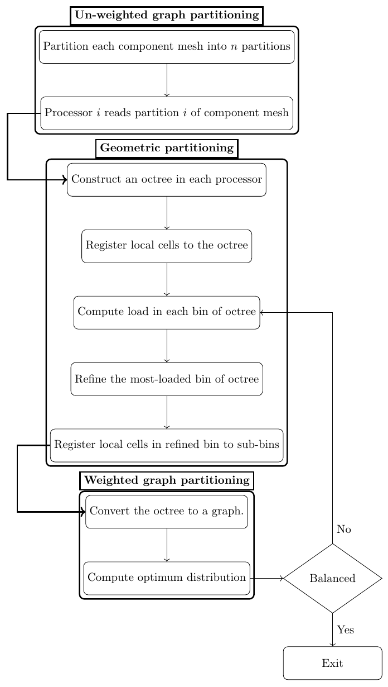

Overview
========

.. toctree::
   :maxdepth: 2
   :hidden:

   index
   solver
   partitioning

tailor is a spatially load balancing flow solver which can operate on three-dimensional moving overset meshes.

Why use overset grid technique
------------------------------

The left-most figure below is a helicopter model consisting of six components: A fuselage, a hub and four blades. It is difficult to generate a single structured grid around all the components. It is possible to generate a single unstructured grid around all the components, however, it is usually desired to have structured mesh especially in the boundary layer of components. Even if the single structured mesh is generated with great difficulties, in moving body problems, the single structured would need to be re-generated. It is possible to avoid mesh re-generation by allowing meshes to deform. However, careful mesh deformation techniques should be applied in order to avoid excessive mesh deformation which causes lower solution accuracy.

How overset grid technique works
--------------------------------

In overset grid technique, a mesh is generated independently for each component. In the case of helicopter, a spherical mesh can be generated for the hub as shown in center figure above. Note that, only outline of the mesh shown for clarity. Similarly, a cylindrical mesh can be generated for a blade as shown in right-most figure above. For the fuselage, a spherical mesh can be used which would also act as a background mesh containing all other meshes.

Overset grid technique versus sliding mesh technique
----------------------------------------------------

In sliding mesh technique meshes cannot overlap but only slide. It is possible to simulate the helicopter model shown above with sliding mesh technique. However, it is impossible to add a tail rotor to the model in sliding mesh technique but there is no such limitation in overset mesh technique.

Partitioning
------------

Graph partitioners such as METIS, partitions each component mesh independently. Therefore, a partition does not contain more than one mesh. Also, METIS with default settings produces partitions that contain approximately the same number of cells. In overset mesh technique, overlapping mesh-cells need to be in the processors. In order to bring overlapping mesh-cells to the same partitions, geometric partitioning is applied. An octree is used to registed mesh-cells based on their spatial locations.

Load balancing
--------------

For balanced distrubution of work-load, the octree is refined adaptively at the most-loaded octree-bins until balanced distribution of octree-bins to processors is possible. At each refinement step, octree is converted to a graph and passed to METIS to find optimum distribution.

Test cases
----------

I will provide parallel performance and validation results on pitching transonic airfoil, isentropic vortex, ONERA M6 and helicopter test cases.

Dependencies
------------

* Few `Boost`_ libraries such as
    * Boost MPI for parallelization
    * Boost Serialization to save & restore data.
    * Boost Program_options for reading configuration files.
* `METIS`_ for load balancing.
* `Gmsh`_ for mesh generation in msh format.
* `amgcl`_ for solution of linear system of equations if implicit formulation is used.

.. _Boost : https://www.boost.org/
.. _METIS : http://glaros.dtc.umn.edu/gkhome/metis/metis/overview
.. _Gmsh : https://gmsh.info/
.. _amgcl : https://github.com/ddemidov/amgcl

