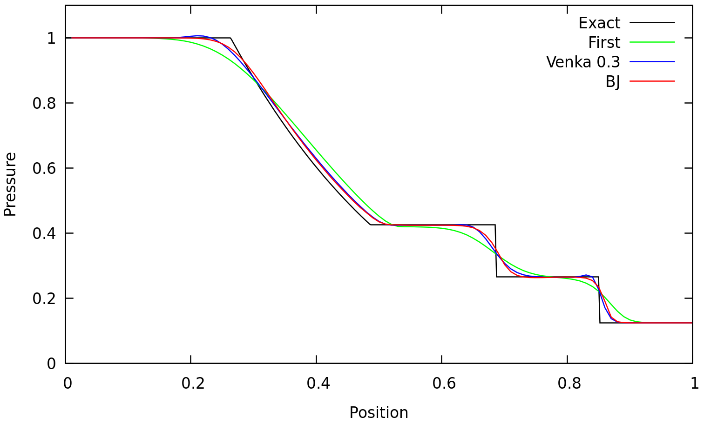
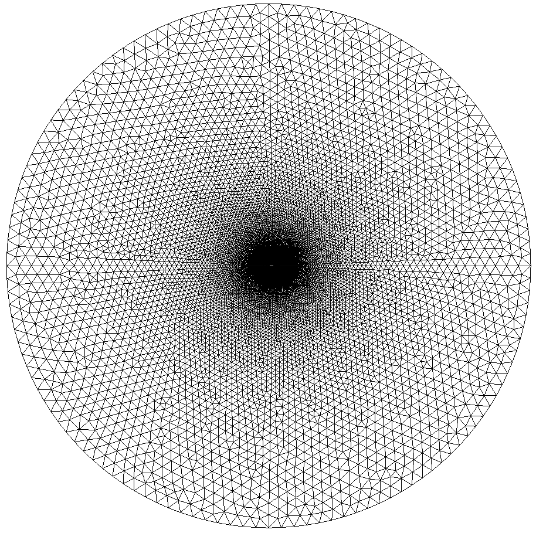
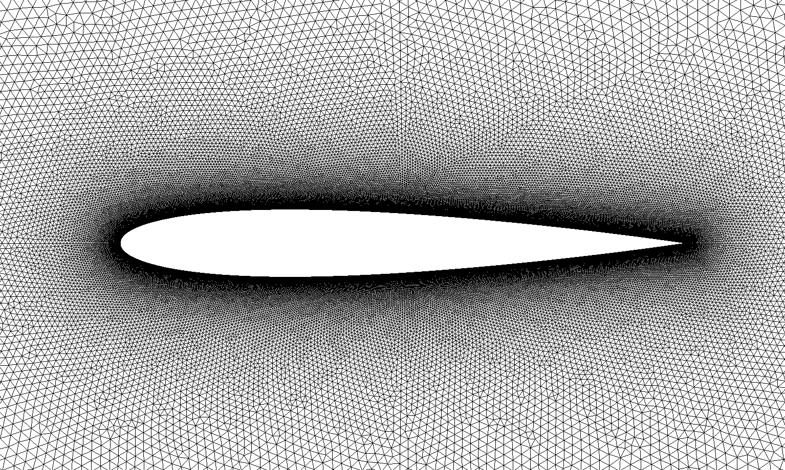
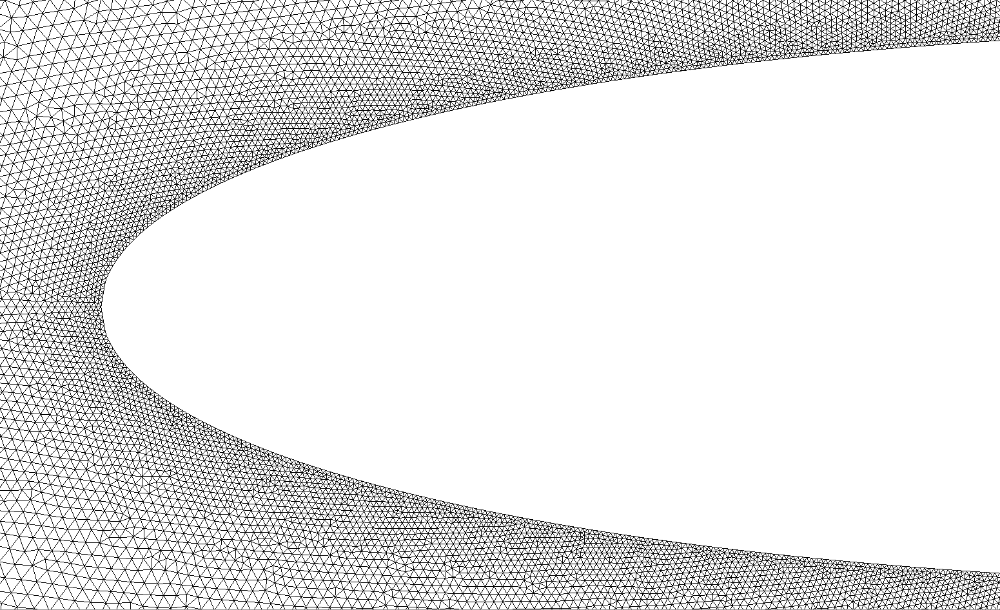
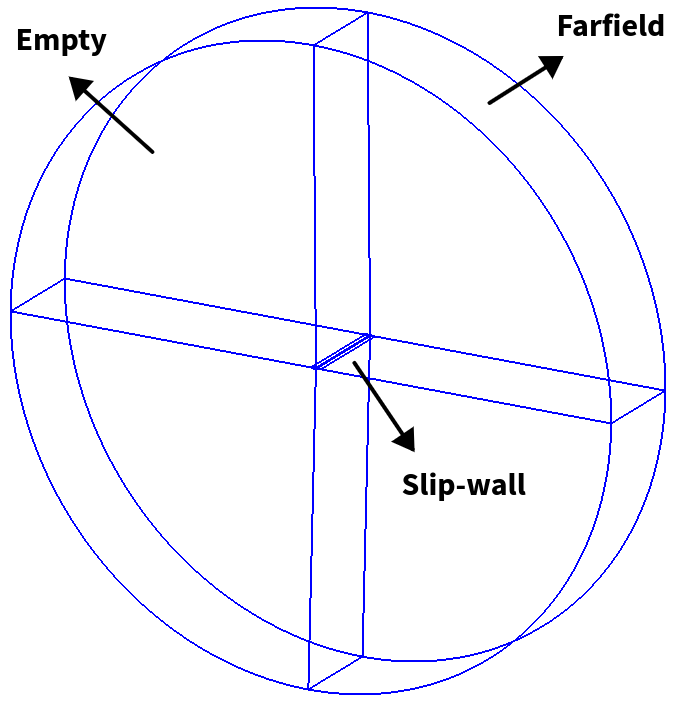
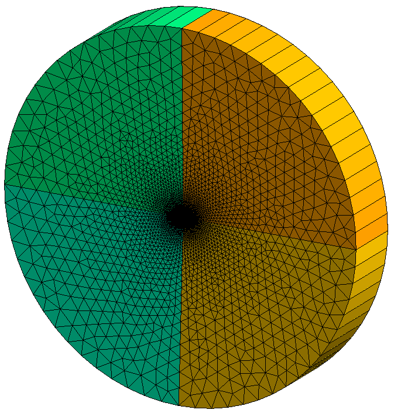
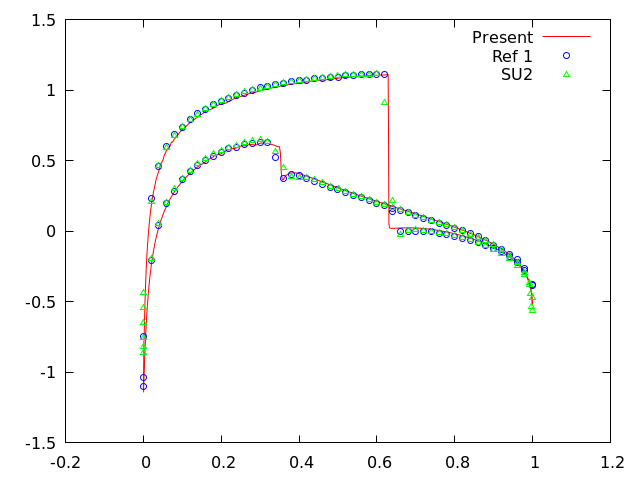
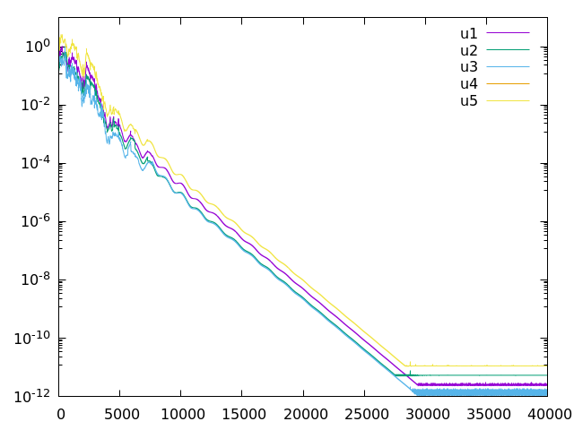

Test cases
==========

.. _shock-tube:

Shock tube
----------

Shock tube test case is comprised of a tube of unit length containing initially two gases separated by an imaginary membrane at x = 0.

Mesh properties
^^^^^^^^^^^^^^^

Mesh is comprised of 100 cells.

Initial condition
^^^^^^^^^^^^^^^^^

Flow is initizalized by reading `flow_init.ini <https://github.com/orxshi/tailor/blob/main/test/shock_tube/flow_init.ini>`_.

.. list-table:: Initial profile
   :header-rows: 1

   * - Variable 
     - Left
     - Right
   * - Density
     - 1.0
     - 0.125
   * - Pressure
     - 1.0
     - 0.1
   * - Velocity
     - 0.0
     - 0.0

.. list-table:: Solver parameters
   :header-rows: 0

   * - Flow type
     - Unsteady
   * - Riemannsolver
     - Roe
   * - Temporal discretization
     - Runge-Kutta (4-stage)
   * - Scheme
     - MUSCL
   * - Limiter
     - Venkatakrishnan (K = 0.3), Barth-Jespersen
   * - Time step
     - 1e-3
   * - Number of time steps
     - 200

Boundary condition
^^^^^^^^^^^^^^^^^^

Flow in the tube is made one-dimensional by imposing empty boundary conditions in peripheral surfaces of the tube. At caps of the tube, dirichlet boundary condition is imposed.

Results
^^^^^^^

Following results correspond to :math:`t = 0.2` seconds.

Remarks
*******

* Second order spatially-accurate results are better than first order one.
* A limiter is required otherwise the code blows up if only gradient is used for flux reconstruction at cell-faces.
* Venkatakrishnan limiter with coefficient of :math:`K=0.3` is not TVD, hence, overshoots are observed near discontinuities.

.. _steady-transonic-airfoil:

Steady transonic airfoil
------------------------

A single unstructured mesh is used to solve the Euler equations at transonic air speed to steady state. Flow and solver properties are shown in the following tables. The mesh is rotated :math:`1.25^\circ` clock-wise, therefore, the freestream x-velocity has no angle of attack. Freestream pressure and density are adjusted such that sound speed is unity and freestream velocity is identical to Mach number.

.. list-table:: Flow properties
   :header-rows: 0

   * - Mach
     - 0.8
   * - Angle of attack
     - :math:`1.25^\circ`
   * - Freestream pressure
     - 1 / 1.4
   * - Freestream density
     - 1
   * - Ratio of specific heats
     - 1.4

.. list-table:: Solver parameters
   :header-rows: 0

   * - Flow type
     - Steady
   * - Riemann solver
     - Roe
   * - Temporal discretization
     - Backward Euler
   * - Scheme
     - MUSCL
   * - Gradient computation
     - Least-squares
   * - Limiter
     - Venkatakrishnan (K = 0.3)
   * - CFL
     - 10

Settings are read from `settings.ini <https://github.com/orxshi/tailor/blob/main/test/airfoil_static_single_mesh/settings.ini>`_.

Mesh properties
^^^^^^^^^^^^^^^

Following figures shows the unstructured mesh used for solving transonic airfoil test case. 

|

Cell size is the finest near the airfoil and grows proportional to distance from the airfoil surface. Cell size is controlled with combination of ``Field`` in `NACA0012_O.geo <https://github.com/orxshi/tailor/blob/main/test/airfoil_static_single_mesh/msh/NACA0012_O.geo>`_ as shown below.::

   lc = 1;
   Field[1] = Distance;
   Field[1].FacesList = {wallbc[]};
   Field[1].NNodesByEdge = 100;
   Field[2] = MathEval;
   Field[2].F = Sprintf("F1/20 + %g", lc / 1000);
   Background Field = 2;

According to the snippet above, cell size is set with equation `distance/20 + 1/1000`. I don't know how cell size is related to cell volume in Gmsh. There 137228 cells with shape of triangular prism in the unstructured mesh. The reason of having three-dimensional (3D) cells in a two dimensional(2D) problem is because Tailor always works in 3D space similar to OpenFOAM. This kind of problems are called 2.5-dimensional. The 3D mesh is obtained by extruding the 2D mesh by one layer. 

Since there 32 processors, initially the mesh is also partitioned into 32 partitions. ::

    gmsh NACA0012_O.geo -3 -oneFilePerPart -part 32 -format msh2

Boundary conditions
^^^^^^^^^^^^^^^^^^^

Boundary conditions on the airfoil and in outer boundary are slip-wall and Riemann, respectively. Riemann boundary condition is based on Riemann invariant equations. Empty boundary conditions are used in z-normal direction. Initially flow is set to freestream values everywhere in the domain.

Job submission
^^^^^^^^^^^^^^

The code works even when CFL is greater than 10 however, residuals do not converge below 1e-2 in that case. The script below is the SLURM script used to submit a job to the cluster. ::

   #!/bin/bash
   #SBATCH -p short
   #SBATCH --ntasks=32
   #SBATCH --hint=nomultithread
   #SBATCH -t 00-04:00:00
   #SBATCH --output=slurm-%j.out
   #SBATCH --error=slurm-%j.err
   mpirun --tag-output --report-bindings /usr/bin/time -f '%e %S %U %P %M' -o "timing.dat" --append ./out

Results
^^^^^^^

Figure below shows pressure coefficients at the airfoil surface and convergence history.

|

Remarks
*******

* Compared to other references, finer mesh is needed to accurately solve pressure and force coefficients.
* There is practically no difference between results of first and second order spatial accuracy. This may be due to steady state solution.

..
It is useful to have raw pressure coefficient data to compare results, especially when data for upper and lower surfaces are provided separately. This saves time by avoiding plot digitizing. Here are pressure coefficient data for `upper_pc.dat <https://github.com/orxshi/tailor/blob/main/test/airfoil_static_single_mesh/upper_pc.dat>`_ and `lower_pc.dat <https://github.com/orxshi/tailor/blob/main/test/airfoil_static_single_mesh/lower_pc.dat>`_ airfoil surfaces.
    
Reference 1: Manzano, Luis, Jason Lassaline, and David Zingg. "A Newton-Krylov algorithm for the Euler equations using unstructured grids." 41st Aerospace Sciences Meeting and Exhibit. 2003.
Reference 2: `<https://su2code.github.io/tutorials/Inviscid_2D_Unconstrained_NACA0012/>`_

   

Oscillating airfoil
-------------------

.. math::

\alpha = \alpha_mean + \alpha_amp sin(\omega t)

